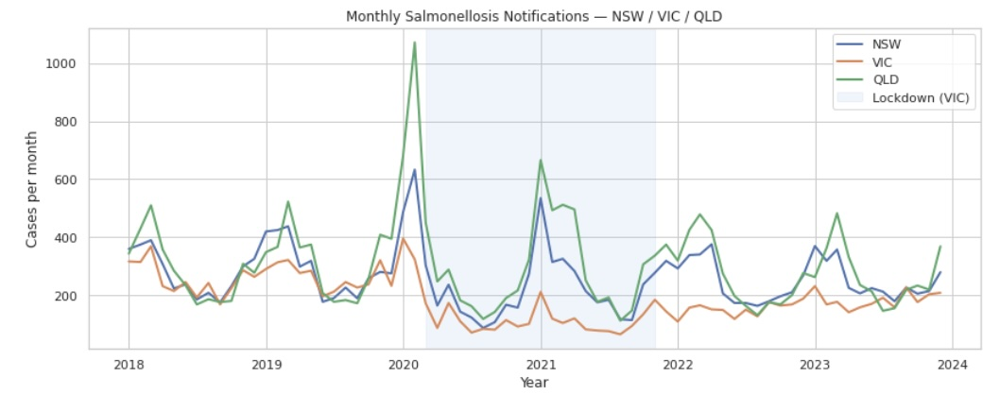

# Salmonellosis-Trend-Analysis
A data analysis project exploring Salmonellosis notification trends across NSW, VIC and QLD (2018–2023). This was an introductory project undertaken to learn matplotlib and pandas, using a publicly available health dataset. After noticing an unusual dip in Victorian cases around 2020–2021, QLD was added as a comparison state given its significantly lighter lockdown restrictions relative to VIC. NSW was included as an additional reference point.

The visual suggests a possible correlation between lockdown stringency and reduced Salmonellosis incidence, potentially due to reduced social mixing and food handling outside the home. However, further investigation would be needed to establish any causal relationship, as other confounding factors, such as changes in healthcare-seeking behaviour and reporting rates during the pandemic, may also contribute to the observed trends.

Note: This is an early exploratory project and is not intended as a complete or rigorous analysis. It is included here as a record of initial data exploration and learning.

## Data Source

- Australian Government Department of Health — National Notifiable Diseases Surveillance System (NNDSS)
- Dataset: Salmonellosis notifications by state/territory, weekly data
- Available at: https://www.health.gov.au/resources/collections/nndss-public-dataset

